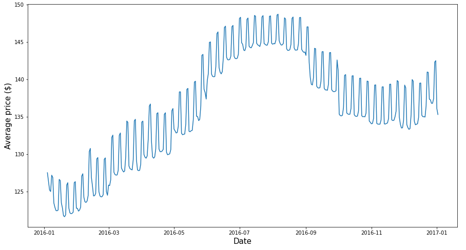
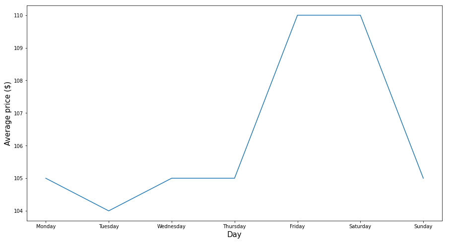
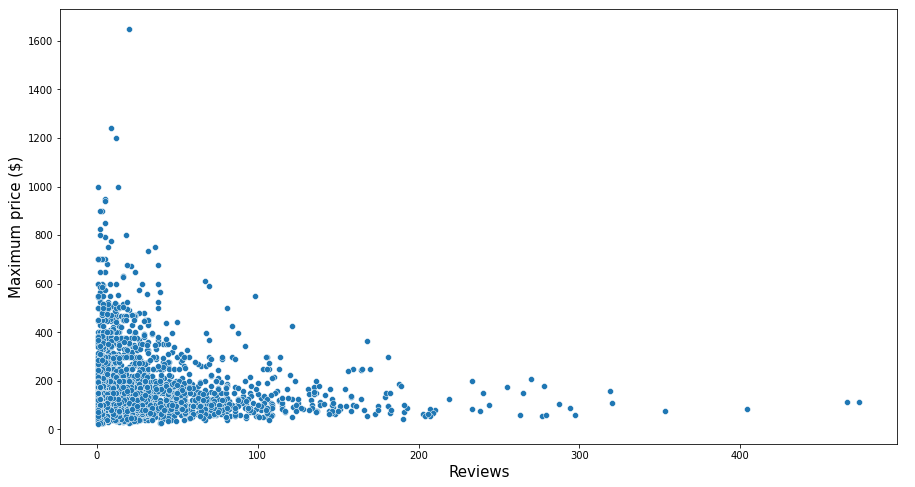

Photo via <a href="https://www.goodfreephotos.com/">Good Free Photos</a>

# Ever wanted to go to Seattle on a budget?

Getting an affordable flat or apartment with airbnb is not always a breeze. Even worse in a city like Seattle. 

Let's takle this problem armed with data-science an a years worth of price and review data for all listings in Seattle.

Exploring the data I want to answer 3 Questions:

- Which season is favoured for a cheap visit?
- Should I rent on the weekend or workdays?
- Are listing with more reviews more expensive?

Let's dive into the data and look at my first question.

# Which season is favoured for a cheap visit?

To answer this question we'll have a look at prices for listings spanning a whole year. Prices shown are average prices per day.

As we can see, summer should definetly be avoided. Our best bet for low prices seams to be the winter and autumn, bar new year's eve. This is not suprising as demand should be high in the sunnier months and people want to go on holiday. So go off season, go in the winter.

But we see some interesting bits in this graph. Prices seem to spike quite often, and those spikes are not small ones. In some cases reaching upwars of 10% difference. With the amount of spikes we can estimate a weekly pattern. 

# Should I rent on the weekend or workdays?

If we expect a weekly pattern we should look at weekdays. I'll show you average prices per weekday for the whole year. This way we will hopefully see a trend we can leverage to save some money.

The average price suggests that Tuesday would be the best day for bargains.

But are there any other factors we can look out for while getting a cheap stay in Seattle? Should we favour listings with many reviews or are less reviewed listings going to be cheaper?

# Are listing with more reviews more expensive?

We could assume that listings with many reviews are more in demand as they are more popular. This popularity could increase the price as demand for a popular listing could drive it's price up. But does the data support this claim?

Listings with many reviews do not peak our max price, but rather seem to be in the lower price range. Other listings with just a few reviews have a much higher price tag. But we can also see some listings with few to no reviews and the lowest possible price. These could be our best shot for a budget stay.

# What are you waiting for?

Now that we know when, winter on possibly a Tuesday, and how, a listing with few ratings, we can get a cheap stay in Seattle and have more allowance for exploration and memorable experiences! Go for it, book your trip now.
